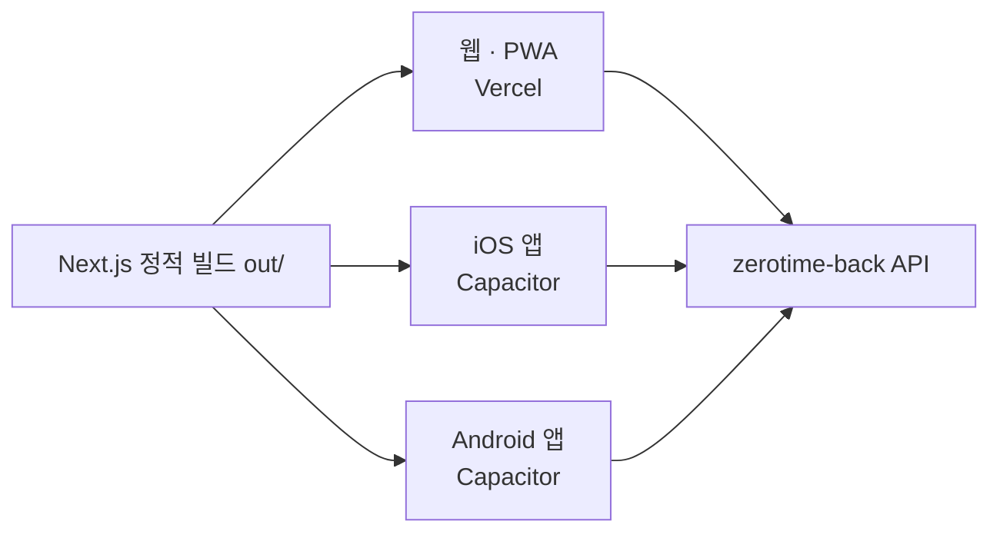
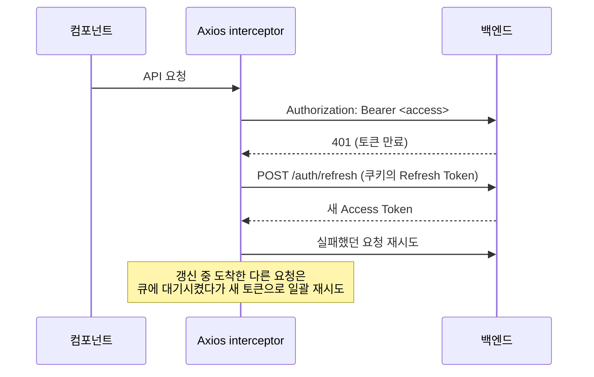

<p align="center">
  
</p>

<p align="center">
  <b>전북대학교 공지, 이제 한곳에서 — 제로타임</b><br />
  교내 150개+ 게시판의 공지를 구독 기반으로 모아보고, 키워드 알림으로 놓치지 않는 서비스
</p>

<p align="center">
  <a href="https://zerotime.kr"></a>
  
  
  
  
  
</p>

---

전북대 공지사항은 본부·단과대·학과·사업단 홈페이지에 흩어져 있어, 학생이 장학금·행사·채용 공지를
놓치기 쉽습니다. **제로타임**은 이 공지들을 한곳에 모아 내가 구독한 게시판만 보여주고,
키워드가 매칭되면 알려줍니다. 이 저장소는 그 프론트엔드로, **한 코드베이스에서 웹·PWA·iOS·Android를
모두 빌드**합니다.

- 🌐 **운영**: https://zerotime.kr
- 🧪 **개발**: https://dev.zerotime.kr
- 🔌 **백엔드 API**: [zerotime-back](https://github.com/zeroone-2025/zerotime-back) (FastAPI)

## 목차

- [주요 기능](#주요-기능)
- [서비스 환경](#서비스-환경)
- [기술 스택](#기술-스택)
- [아키텍처](#아키텍처)
- [시작하기](#시작하기)
- [폴더 구조](#폴더-구조)
- [개발 규칙](#개발-규칙)
- [테스트](#테스트)
- [네이티브 앱 (Capacitor)](#네이티브-앱-capacitor)
- [배포](#배포)
- [자주 겪는 문제](#자주-겪는-문제)
- [기여](#기여)

## 주요 기능

- 📄 **통합 공지 피드** — 150개+ 게시판(본부·단과대·학과·사업단) 공지를 하나의 리스트로. 무한 스크롤과 로딩 스켈레톤으로 네이티브 앱 같은 사용감을 냅니다.
- 🎛️ **구독 필터** — 내가 고른 게시판만 피드에 표시. 전체 / 안 읽음 / 키워드 / 즐겨찾기 탭으로 2차 필터링합니다.
- 🔔 **키워드 알림** — "장학", "인턴" 같은 키워드를 등록하면 매칭된 공지를 따로 모아 보여줍니다.
- ✅ **읽음·즐겨찾기** — 공지별 읽음 상태를 추적하고, 나중에 볼 공지는 즐겨찾기에 보관합니다.
- 🗓️ **친바** — 팀·그룹의 일정 조율. 참가자들의 가능 시간을 모아 겹치는 시간을 찾고, 랭킹으로 참여를 독려합니다.
- 📅 **시간표** — 학기별 시간표 관리. 시간표 이미지를 올리면 AI가 인식해 자동 입력합니다.
- 💼 **커리어 프로필** — 학력·경력·활동을 정리하는 프로필.
- 📱 **어디서나** — 브라우저, 홈 화면 설치(PWA), iOS/Android 네이티브 앱을 모두 지원합니다.
- 🔐 **소셜 로그인** — Google · Apple · Naver · Kakao.

## 서비스 환경

브랜치 push가 곧 웹 배포입니다(Vercel 자동 배포).

| 브랜치 | 환경 | 웹 | 백엔드 API |
|---|---|---|---|
| `develop` | 개발 | dev.zerotime.kr | dev-api.zerotime.kr |
| `main` | 운영 | zerotime.kr | api.zerotime.kr |

네이티브 앱은 별도로 빌드해 스토어에 제출합니다 — [네이티브 앱](#네이티브-앱-capacitor) 참조.

## 기술 스택

| 분류 | 선택 | 비고 |
|---|---|---|
| 프레임워크 | Next.js 16 (App Router) + React 19 + TypeScript | `output: 'export'` 정적 빌드 — Capacitor가 그대로 감쌈 |
| 스타일 | Tailwind CSS v4 | 태블릿 호환용 커스텀 `md` breakpoint(832px) |
| 서버 상태 | @tanstack/react-query | 공지 목록, 무한 스크롤, 캐싱 |
| 클라이언트 상태 | Zustand | 사용자 전역 상태 (`app/_lib/store/`) |
| HTTP | Axios | JWT interceptor — 401 시 큐 기반 자동 토큰 갱신 |
| 네이티브 | Capacitor 8 | iOS/Android, appId `kr.zerotime.app` |
| PWA | @ducanh2912/next-pwa | Service Worker 수동 등록, API는 NetworkFirst 캐싱 |
| 테스트 | Vitest + Playwright | 단위 + E2E·비주얼 리그레션 |

## 아키텍처

한 번의 정적 빌드(`out/`)가 세 플랫폼으로 나갑니다:



- **플랫폼별 API 주소** — 웹과 네이티브가 서로 다른 주소를 쓸 수 있게 환경 변수를 분리했습니다. 감지 로직: `app/_lib/api/client.ts`의 `getApiBaseUrl()`.
- **홈 피드 필터링** — ① 구독한 게시판으로 거르고 → ② 전체/안읽음/키워드/즐겨찾기 탭으로 거르는 2단계 파이프라인 (`app/(main)/(home)/`).
- **게시판 정의** — `app/_lib/constants/boards.ts`의 `BOARD_MAP`에 150개+ 게시판의 이름·색·카테고리가 모여 있습니다. 게시판 추가는 이 파일 한 곳만 고치면 됩니다 (백엔드 `board_code`와 키가 일치해야 함).

### 인증 흐름

OAuth 2.0 → JWT. Access Token은 메모리, Refresh Token은 HttpOnly 쿠키에 보관합니다.
구현은 `app/_lib/api/client.ts`.



## 시작하기

### 필수 조건

- Node.js 18 이상
- 백엔드 API — 기본값 `http://localhost:8080`. [zerotime-back](https://github.com/zeroone-2025/zerotime-back)을 로컬에서 실행하세요.

> 팀 공용 작업공간(zerotime-harness)에서 작업한다면 하네스 루트의 `./dev.sh`가 백엔드·프론트를 tmux로 함께 띄웁니다.

### 설치와 실행

```bash
git clone https://github.com/zeroone-2025/zerotime-front.git
cd zerotime-front
npm install

cp .env.sample .env.local   # API 주소 설정
npm run dev                  # → http://localhost:3000
```

또는 검사·설치·실행을 한 번에 해주는 스크립트를 써도 됩니다: `./run-dev.sh`

### 환경 변수

| 변수 | 용도 |
|---|---|
| `NEXT_PUBLIC_API_BASE_URL_WEB` | 웹 브라우저에서 사용할 API 주소 |
| `NEXT_PUBLIC_API_BASE_URL_NATIVE` | Capacitor 네이티브 앱에서 사용할 API 주소 |

정적 export라서 환경 변수는 **빌드 타임에 고정**됩니다 — 값을 바꿨다면 다시 빌드해야 합니다.

### npm 스크립트

| 명령 | 동작 |
|---|---|
| `npm run dev` | 개발 서버 (http://localhost:3000) |
| `npm run build` | 프로덕션 정적 빌드 (`out/`) |
| `npm run lint` | ESLint |
| `npm run test` / `test:run` | Vitest 단위 테스트 (watch / 1회) |
| `npm run test:e2e` / `test:e2e:ui` | Playwright E2E (전체 / UI 디버깅 모드) |

## 폴더 구조

Next.js private folder 컨벤션을 사용합니다 — 언더스코어 접두사 폴더는 라우팅에서 제외됩니다.

```
app/
├── (auth)/              # 로그인, OAuth 콜백, 온보딩
├── (main)/              # 메인 앱 (로그인 후)
│   ├── (home)/          #   홈 — 공지 피드 + 2단계 필터링
│   ├── filter/          #   게시판 구독 설정
│   ├── keywords/        #   키워드 관리
│   ├── notifications/   #   알림
│   ├── chinba/ teams/   #   친바 — 일정 조율·팀
│   ├── flow/            #   커리어 플로우
│   └── profile/         #   프로필
├── _components/         # 전역 공유 컴포넌트
│   ├── layout/          #   레이아웃 (Sidebar 등)
│   ├── ui/              #   재사용 UI (Toast, Badge 등)
│   └── system/          #   시스템 (ServiceWorker 등록 등)
├── _lib/                # 로직 계층
│   ├── api/             #   도메인별 API 클라이언트 + axios 설정
│   ├── hooks/           #   커스텀 훅
│   ├── store/           #   Zustand 스토어
│   └── constants/       #   BOARD_MAP 등 상수
├── _context/            # React Context providers
└── _types/              # TypeScript 타입 정의
```

각 라우트는 자체 `_components/`, `_hooks/` 폴더를 가질 수 있습니다 (기능 단위 응집).

## 개발 규칙

### 코드 스타일

- ESLint(Next.js core-web-vitals + TypeScript) + Prettier 통합. 커밋 전 `npm run lint`.
- import 순서: **React → 외부 패키지 → 내부 alias(`@/_lib/*`, `@/_components/*`) → 상대 경로**
- unused vars는 error, explicit any는 warn.

### 스타일링

- **`md` breakpoint는 832px(52rem)** — 기본 768px이 아닙니다. iPad Pro 세로부터 데스크톱 레이아웃을 주기 위한 커스텀 값 (`app/globals.css`의 `@theme`).
- **동적 색상은 safelist 범위 안에서** — 게시판 색상처럼 런타임에 조합되는 `bg-*`/`text-*` 클래스는 `tailwind.config.js`의 safelist 패턴에 등록된 색상·명도만 씁니다. 패턴 밖의 색은 프로덕션 빌드에서 purge되어 **dev에서는 보이고 배포에서만 사라지는** 버그가 됩니다.
- 유틸리티: `no-scrollbar`, safe-area 대응, fadeIn/slideUp 애니메이션 (`app/globals.css`).

### PWA 동작 조건

Service Worker는 `app/_components/system/`에서 수동 등록하며, **개발 모드와 Capacitor 빌드
(`CAPACITOR_BUILD=true`)에서는 비활성**입니다 (`next.config.ts`). API 응답은 NetworkFirst(5분),
정적 리소스는 CacheFirst로 캐싱합니다.

## 테스트

### 단위 테스트 (Vitest)

```bash
npm run test          # watch 모드
npm run test:coverage # 커버리지 리포트
```

### E2E 테스트 (Playwright)

**백엔드 없이 돌아갑니다** — `page.route()`로 API를 가로채 목 데이터를 반환하므로,
CI에서도 프론트만으로 전 페이지를 검증할 수 있습니다.

```bash
npm run test:e2e                          # 전체
npx playwright test e2e/filter.spec.ts    # 특정 페이지만
npm run test:e2e:ui                       # UI 모드 디버깅
```

- **인증 상태 제어** — `asGuest` / `asLoggedInUser` 픽스처로 로그인/비로그인 시나리오 전환 (`e2e/fixtures/auth.fixture.ts`)
- **비주얼 리그레션** — `toHaveScreenshot()` 스크린샷 비교. 기준 이미지는 git으로 관리하며, UI를 의도적으로 바꿨다면 갱신합니다:
  ```bash
  npx playwright test e2e/visual/ --update-snapshots
  ```

## 네이티브 앱 (Capacitor)

정적 빌드 결과(`out/`)를 Capacitor가 감싸 네이티브 앱으로 만듭니다. 설정: `capacitor.config.ts`

```bash
npm run build            # out/ 생성
npx cap sync             # ios/, android/ 프로젝트에 반영
npx cap open ios         # Xcode 열기 (Mac)
npx cap open android     # Android Studio 열기
```

- **iOS 개발** — Mac에서 `./run-ios.sh` 한 번으로 빌드→sync→시뮬레이터 실행. 상세: [docs/ios-dev-guide.md](docs/ios-dev-guide.md)
- **스토어 릴리스** — [IOS_RELEASE_CHECKLIST.md](IOS_RELEASE_CHECKLIST.md)의 체크리스트를 따릅니다.
- 네이티브에서는 `CapacitorHttp`·`CapacitorCookies` 플러그인으로 쿠키 기반 인증을 유지하고, OAuth 복귀는 `kr.zerotime.app://` 커스텀 스킴을 사용합니다.

## 배포

- **웹** — Vercel이 브랜치 push를 감지해 환경별로 자동 배포합니다 ([서비스 환경](#서비스-환경) 표 참조).
- **네이티브** — 릴리스 체크리스트에 따라 수동으로 App Store / Play Store에 제출합니다.

## 자주 겪는 문제

| 증상 | 원인·해결 |
|---|---|
| 환경 변수를 바꿨는데 반영 안 됨 | 정적 export는 빌드 타임에 값을 고정 — dev 서버 재시작 또는 재빌드 |
| 색상이 dev에선 보이는데 배포에서 사라짐 | Tailwind safelist 패턴 밖의 동적 클래스 — [스타일링](#스타일링) 참조 |
| Service Worker가 로컬에서 동작 안 함 | 개발 모드에서는 의도적으로 비활성 (`next.config.ts`) — 확인은 프로덕션 빌드로 |
| API 요청이 CORS로 막힘 | 백엔드 `.env`의 `CORS_ORIGINS`에 `http://localhost:3000` 포함 여부 확인 |
| 832px 근처에서 레이아웃이 이상함 | `md` breakpoint가 기본값(768px)이 아니라 832px임을 감안하고 디버깅 |
| 비주얼 테스트가 계속 실패 | UI를 의도적으로 바꿨다면 `--update-snapshots`로 기준 이미지 갱신 후 함께 커밋 |

## 기여

이슈 제보와 Pull Request를 환영합니다.

1. 기능 브랜치를 만듭니다 — `feature/#<이슈번호>-<짧은설명>`
2. 커밋은 `<type>(<scope>): <설명>` 형식 (한글 설명):
   ```
   feat(keywords): 키워드 추천 목록 추가
   fix(auth): OAuth 콜백 토큰 파싱 오류 수정
   ```
3. `develop` 브랜치로 PR을 보냅니다.

타입·스코프 전체 목록과 Epic 브랜치 전략은 [CLAUDE.md](CLAUDE.md)의 Git Conventions 절에 있습니다.

## 더 읽을 문서

| 문서 | 내용 |
|---|---|
| [docs/ios-dev-guide.md](docs/ios-dev-guide.md) | iOS 개발 환경 가이드 |
| [IOS_RELEASE_CHECKLIST.md](IOS_RELEASE_CHECKLIST.md) | 앱스토어 릴리스 체크리스트 |
| [하네스 위키 capacitor-hybrid-app](../wiki/platform/capacitor-hybrid-app.md) | Capacitor 하이브리드 앱 구조·함정 (도입 계획 문서의 후신) |
| [CLAUDE.md](CLAUDE.md) | AI 에이전트용 컨텍스트 |

---

<p align="center">
  <sub>Made by <a href="https://github.com/zeroone-2025">ZeroOne</a> — 전북대학교</sub>
</p>
